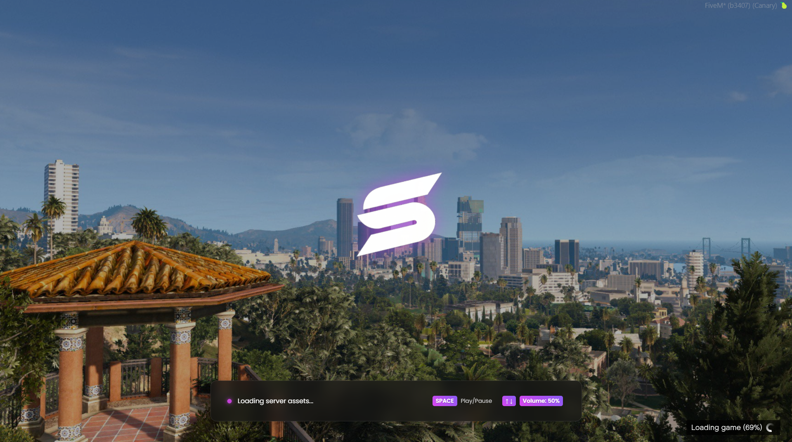

# FiveM Loading Screen

Minimalistic UI with slideshow, logo & music.

## 🚀 Features
- **Auto-Detection:** Detects ESX/QBCore framerwork automatically
- **Controls:** `SPACE` to Play/Pause, `↑ ↓` for Volume.
- **Plug n Play:** No need to configure. Edit images by placing them in `/img`

## 🛠️ Installation
1. Move the folder to your `resources` directory.
2. Add `ensure dx_loading` to your `server.cfg`.

## ⚙️ Configuration
Open `fxmanifest.lua` to toggle debug mode:
```lua
is_debug 'yes' -- Set to 'no' to disable console logs